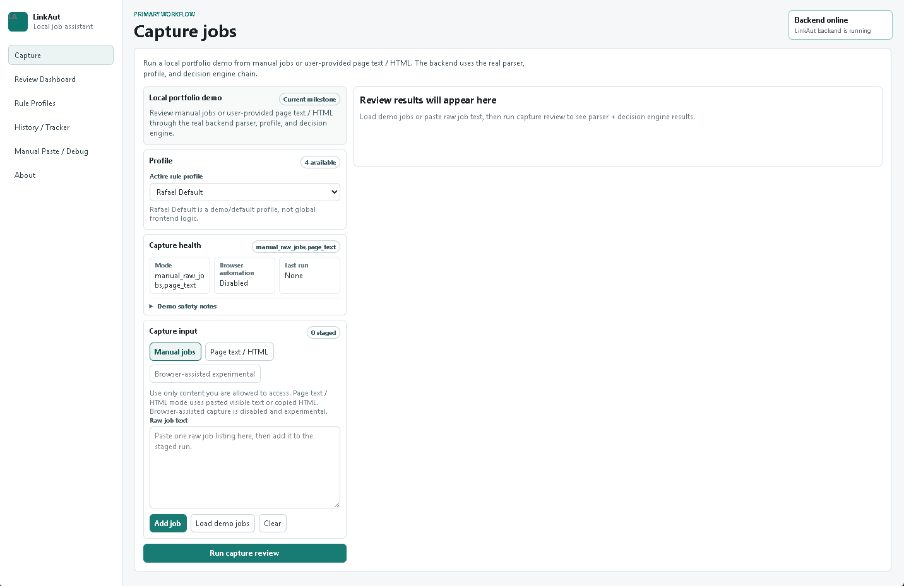
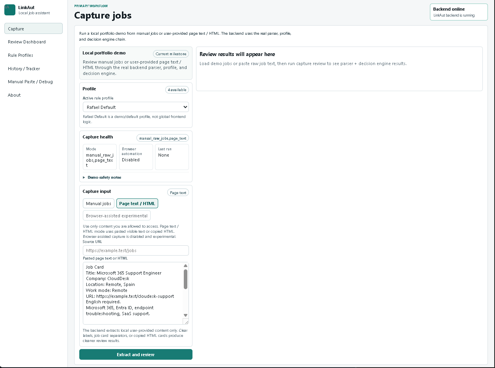
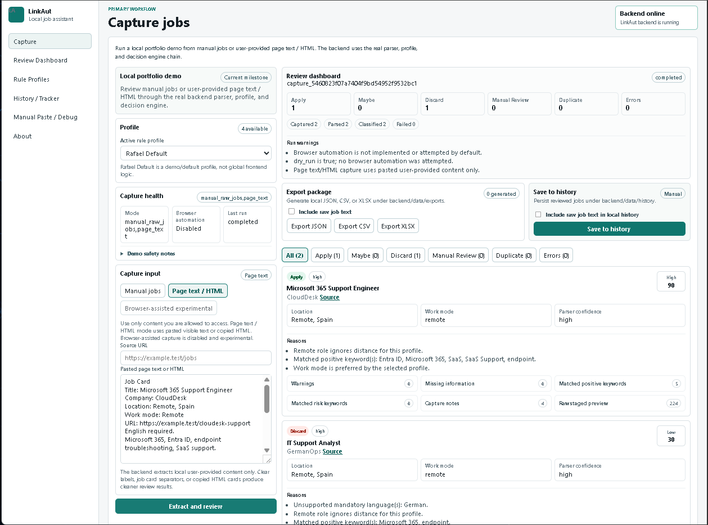
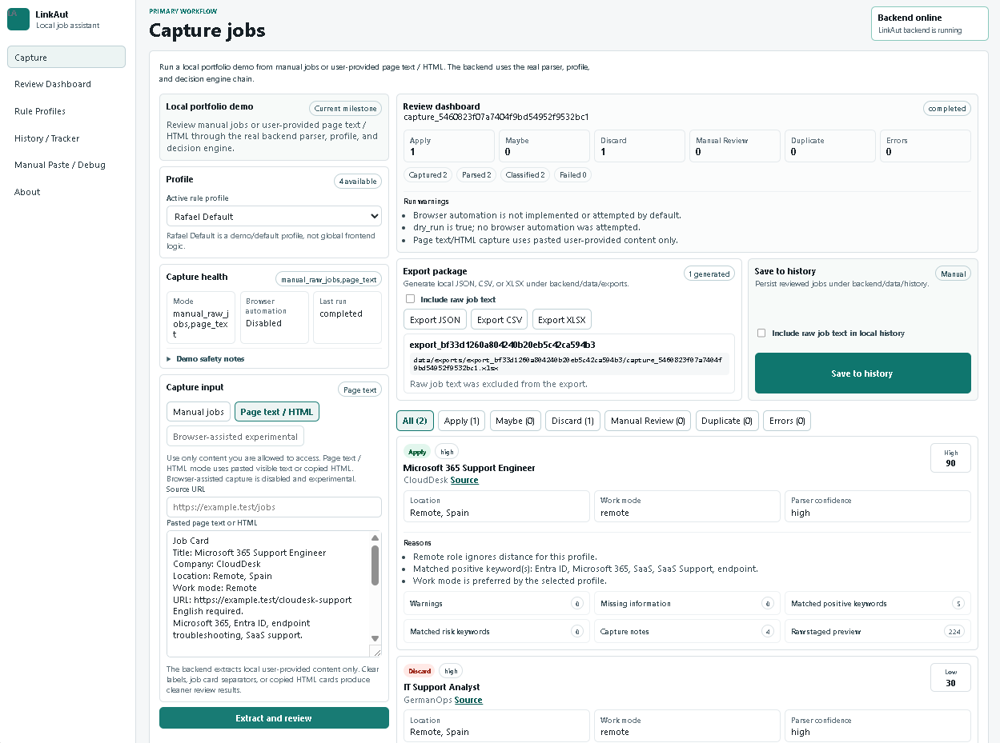
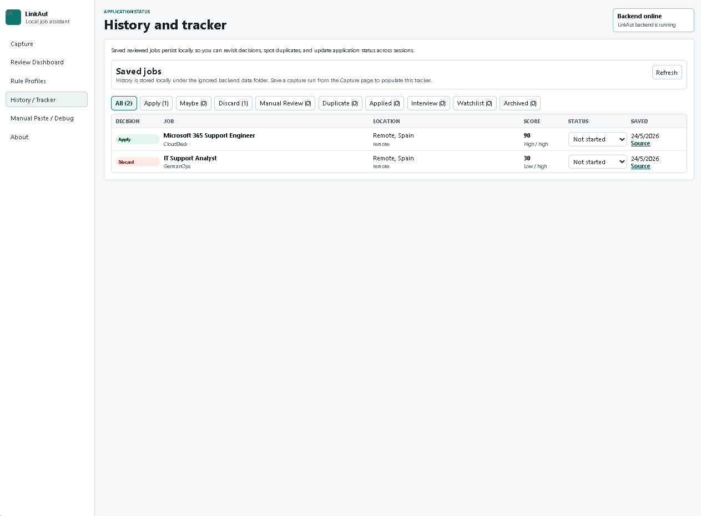
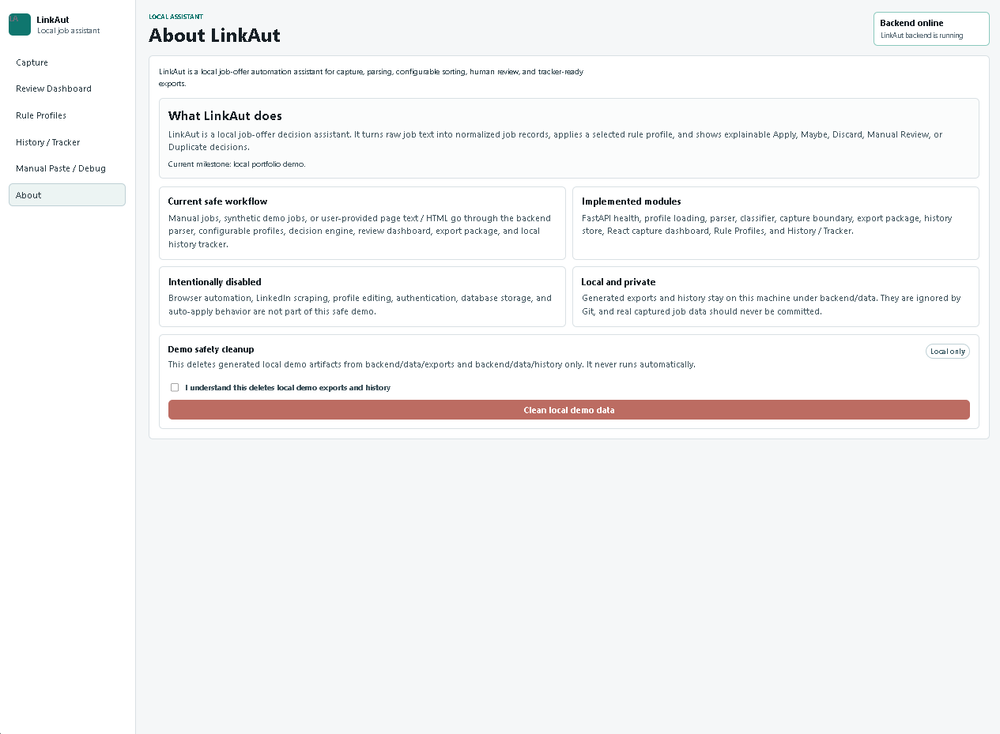

# JOLT — Job Opportunity Logic Tracker

Local job-search decision assistant built with React and FastAPI.

JOLT is a local React + FastAPI portfolio demo that turns raw job-offer text, pasted job-board page text, or copied HTML snippets into structured review results. It parses messy job content, applies a configurable rule profile, explains each Apply / Maybe / Discard / Manual Review / Duplicate decision, and lets the user export or save results locally.

Current milestone: local portfolio demo.

JOLT is not a LinkedIn scraper, not a mass-apply bot, and not a black-box recommender. Browser-assisted capture is represented as an explicit disabled/experimental placeholder; the working capture modes use user-provided content.

## What It Does

- Reviews batches of job-offer text through one local workflow.
- Parses title, company, location, work mode, languages, risk signals, parser confidence, and notes.
- Applies reusable rule profiles instead of hardcoding one person's preferences globally.
- Produces explainable decisions with score, priority, reasons, warnings, missing information, parser confidence, and matched keywords.
- Exports reviewed results as JSON, CSV, or XLSX.
- Saves reviewed jobs into a local history/tracker and supports application status updates.
- Provides a local demo cleanup action for generated export/history files.

## Current Workflow

```text
manual jobs or pasted page text/HTML
-> parser
-> configurable rule profile
-> decision engine
-> review dashboard
-> JSON / CSV / XLSX export
-> local history / tracker
-> optional demo cleanup
```

The Capture page is the primary workflow. Manual paste exists as a fallback/debug mode, and page text / HTML capture is a safe local bridge for content the user supplies.

## Implemented Features

- React + Vite local frontend.
- FastAPI local backend.
- Backend health check at `GET /api/health`.
- Configurable rule profiles loaded from backend JSON.
- Rafael Default as one demo/default profile, not global frontend logic.
- Rule Profiles page for inspecting available profiles and profile details.
- Rule-based parser with parser confidence and parser notes.
- Decision engine with explainable scoring and hard-discard rules.
- Capture runner for manual `raw_jobs` and pasted page text/HTML.
- Conservative page text/HTML extractor for labelled blocks, `Job Card` sections, compact job-board-like text, copied HTML cards, and job-like links.
- Capture health endpoint showing browser automation disabled by default.
- Frontend review dashboard with demo jobs, decision counts, filters, and decision cards.
- Local export package generation under ignored `backend/data/exports/`.
- JSON, CSV, and XLSX export formats.
- Local JSONL history/tracker under ignored `backend/data/history/`.
- Save-to-history and application status updates.
- Demo cleanup endpoint and UI for local exports/history.
- Backend tests for health, profiles, parser, decision engine, capture, export, history, and cleanup.
- Frontend production build with `npm run build`.

## Safe Capture Modes

| Mode | Status | What it does |
| --- | --- | --- |
| Manual jobs | Implemented | User stages one or more raw job texts in the Capture page. |
| Page text / HTML | Implemented | User pastes visible page text or copied HTML; LinkAut extracts local job blocks and sends them through the same parser and decision engine. |
| Browser-assisted experimental | Disabled placeholder | Shown honestly in the UI/API as not enabled; no browser automation is attempted. |

Page text / HTML capture is local and user-controlled. It does not make external network calls, store credentials, bypass authentication, bypass CAPTCHA, or crawl websites.

## What It Intentionally Does Not Do

- No Playwright or Selenium automation.
- No LinkedIn scraping.
- No mass crawling.
- No auto-apply behavior.
- No credential storage.
- No CAPTCHA, paywall, rate-limit, or authentication bypass.
- No profile editing UI yet.
- No database or cloud sync.
- No production deployment.

These are intentional boundaries for the current portfolio demo, not failed features.

## Tech Stack

Frontend:

- React
- TypeScript
- Vite
- Plain CSS

Backend:

- FastAPI
- Pydantic models
- Rule-based parser and decision services
- JSON-backed profiles
- JSONL local history
- `openpyxl` for XLSX export
- `pytest` + FastAPI `TestClient`

## Local Setup

These commands are Windows-friendly and assume you are at the repository root.

### Backend

```powershell
cd backend
python -m venv .venv
.venv\Scripts\activate
python -m pip install -r requirements.txt
python -m pip install -r requirements-dev.txt
python -m pytest
uvicorn app.main:app --reload --no-use-colors
```

Backend URL:

```text
http://127.0.0.1:8000
```

### Frontend

Open a second terminal:

```powershell
cd frontend
npm install
npm run build
npm run dev
```

Frontend URL:

```text
http://localhost:5173
```

## Demo Flow

1. Start the backend.
2. Start the frontend.
3. Open `http://localhost:5173`.
4. Confirm the backend badge is online.
5. On Capture, select `Rafael Default` or another profile.
6. Click `Load demo jobs`.
7. Click `Run capture review`.
8. Review Apply / Discard / Manual Review cards.
9. Export JSON, CSV, or XLSX.
10. Click `Save to history`.
11. Open History / Tracker and update one application status.
12. Open About and optionally clean local demo data.

Page text / HTML demo:

1. Switch Capture to `Page text / HTML`.
2. Paste synthetic labelled job blocks or copied HTML.
3. Click `Extract and review`.
4. Open capture notes on a result card to see extraction hints.

More demo steps are in [docs/demo-checklist.md](docs/demo-checklist.md).

## API Endpoints

Run the backend locally, then use `http://127.0.0.1:8000`.

| Method | Endpoint | Purpose |
| --- | --- | --- |
| GET | `/api/health` | Backend health check. |
| GET | `/api/profiles` | List rule profile summaries. |
| GET | `/api/profiles/{profile_id}` | Load one full rule profile. |
| POST | `/api/parse/job` | Parse raw job text into a normalized job object. |
| POST | `/api/parse-and-classify/job` | Parse raw job text and classify it with a profile. |
| POST | `/api/classify/job` | Classify an already-normalized job. |
| GET | `/api/capture/health` | Report safe capture modes and automation status. |
| POST | `/api/capture/run` | Run capture review from manual jobs or pasted page text/HTML. |
| POST | `/api/export/capture-result` | Generate JSON, CSV, or XLSX files from a capture result. |
| POST | `/api/history/save-capture-result` | Save reviewed capture results into local history. |
| GET | `/api/history/jobs` | List saved reviewed jobs. |
| GET | `/api/history/jobs/{history_id}` | Load one saved job. |
| PATCH | `/api/history/jobs/{history_id}/status` | Update a saved job's application status. |
| POST | `/api/demo/cleanup` | Delete generated local demo files under `backend/data/exports/` and `backend/data/history/`. |

## Screenshots

### Capture workflow

Capture starts from a local portfolio demo workflow with profile selection, capture health, and manual/page-text modes.



### Page text / HTML capture

Page text mode accepts user-provided visible page text or copied HTML and keeps browser automation disabled.



### Review dashboard

Capture results are parsed, classified, filtered, and displayed as explainable decision cards.



### Export package

Reviewed results can be exported locally as JSON, CSV, or XLSX files.



### History / Tracker

Reviewed jobs can be saved locally and tracked with application statuses.



### Local demo safety

The About page documents the local-only demo boundary, disabled automation, and cleanup control.



See [docs/screenshots/README.md](docs/screenshots/README.md) for the screenshot plan.

## Documentation

- [Architecture](docs/architecture.md)
- [Demo checklist](docs/demo-checklist.md)
- [Release checklist](docs/release-checklist.md)
- [Portfolio walkthrough](docs/portfolio-walkthrough.md)
- [GitHub presentation notes](docs/github-presentation.md)
- [Interview explanation](docs/interview-explanation.md)
- [LinkedIn post draft](docs/linkedin-post-draft.md)
- [Engineering log](docs/engineering-log.md)

## Roadmap

- Add richer XLSX tracker sheets and export package metadata.
- Add downloadable export UX.
- Add Apply Today and Manual Review queues derived from saved history.
- Add capture-time duplicate/already-reviewed labels from local history.
- Add profile editing and validation UI.
- Add optional browser-assisted capture only if it can remain explicit, local, recoverable, and respectful of site terms.
- Add a short demo video.

## Privacy And Repository Hygiene

Generated/private job-search data is ignored by Git, including real exports, CSV/JSONL outputs, XLSX trackers, local history, private run folders, logs, local env files, and user-specific profiles.

Do not commit real captured job text, recruiter notes, application history, personal data, access tokens, generated trackers, or private exports.

The demo cleanup button removes generated local files under:

```text
backend/data/exports/
backend/data/history/
```
